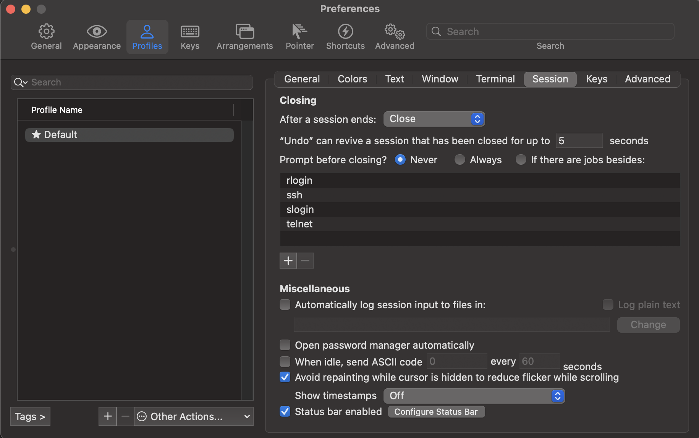
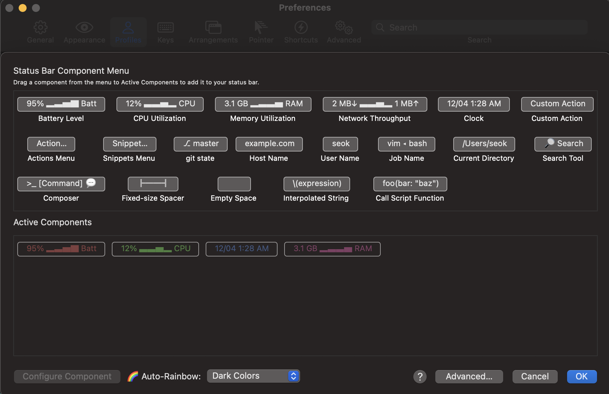
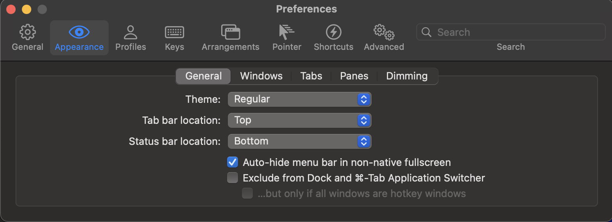
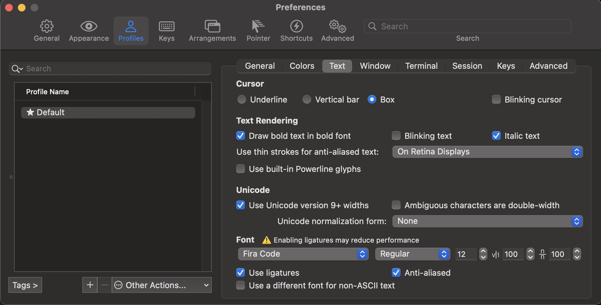
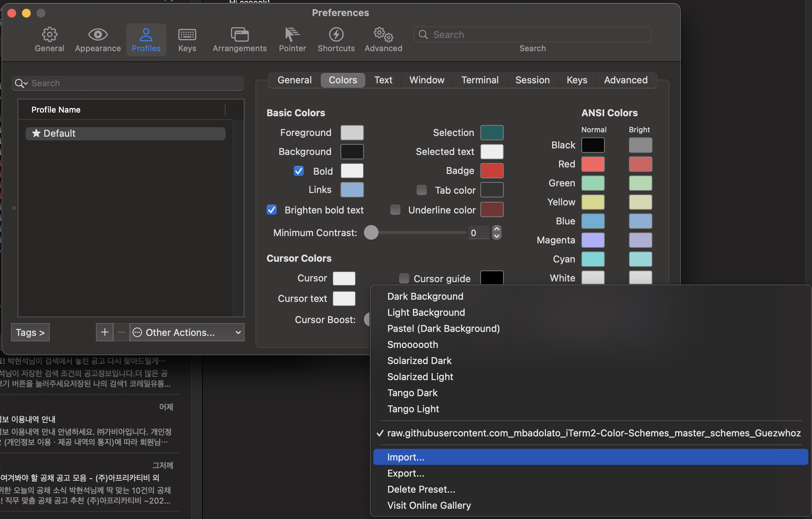
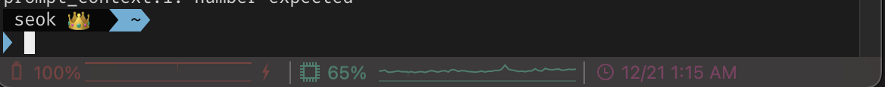
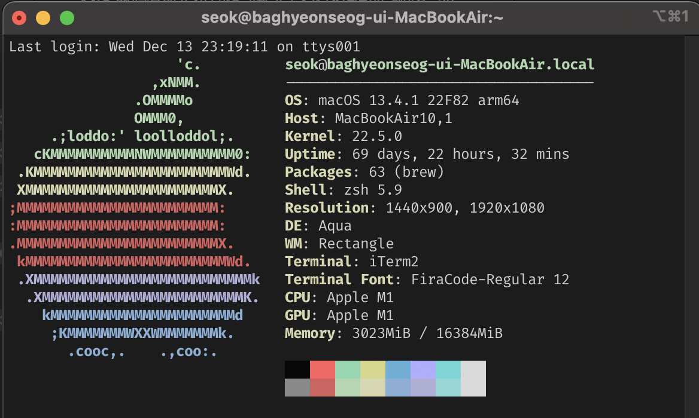
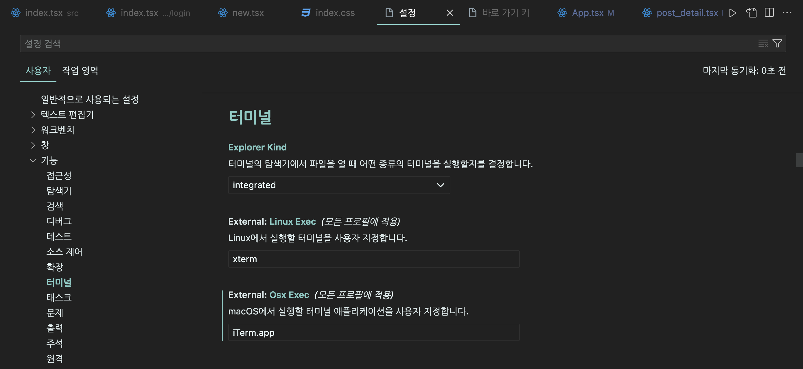
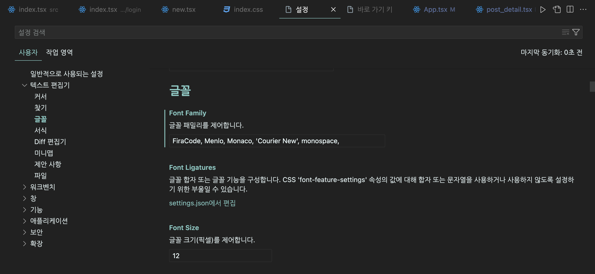

## 1. 기본 개발 환경 세팅 & 터미널 설정

**1. homebrew 구버전 삭제**

```
which brew
```

위의 커맨드 실행시 /usr/local/bin/brew 가 출력되었다면 이미 설치되어 있는 것입니다.  
삭제하려면

```
/bin/bash -c "$(curl -fsSL https://raw.githubusercontent.com/Homebrew/install/HEAD/uninstall.sh)"
```

를 실행해주세요.

**2. homebrew 설치**

```
/bin/bash -c "$(curl -fsSL https://raw.githubusercontent.com/Homebrew/install/HEAD/install.sh)"
```

실행 후 설치가 완료되면, `Add Homebrew to your PATH in /Users/<USER_ID>/.zprofile:` 이라는 문구와 함께 각각 `echo`, `eval`로 시작하는 커맨드가 두 개 안내될 것입니다. 모두 실행해주시면 됩니다.

후에 brew install로 node, yarn, zsh 을 깔아줍니다.

**3. iterm2 설치**

[iterm2 설치](https://iterm2.com/)로 들어가서 다운로드를 해줍니다.





iTerm2 을 실행 시켜 `command + ,` 을 눌러 원하는데로 설정을 해주시면됩니다.

**4. ohmyzsh 설치**

- ohmyzsh 설치

```
sh -c "$(curl -fsSL https://raw.githubusercontent.com/ohmyzsh/ohmyzsh/master/tools/install.sh)"
```

**5. 폰트**

```
brew tap homebrew/cask-fonts
```

```
brew install font-fira-code
```



저의 폰트는 fira-code를 사용합니다.

font의 다운 받은 Fira Code 를 설정해줍니다.

**6. 테마**

[iterm 테마 색상](https://iterm2colorschemes.com/)에 들어가셔서 원하는 테마 색상을 저장을 해줍니다.



`command + ,`으로 설정에 들어가셔서 다운받은걸 import 해주시면 됩니다.

```
vi ~/.zshrc
```

위에 명령어를 터미널에 입력하시고, `ZSH_THEME="agnoster"`을 찾아서 커서를 올리고 i 를 누른후 변경해주고 `esc` 눌러 `:wq` 저장하여 나와줍니다.

설정파일 저장을 다 했으면 iTerm2 를 껏다 켜도 되고,

```
source ~/.zshrc
```

으로 저장해도됩니다.

**7. 빈 줄 넣기**

```
vi ~/.oh-my-zsh/themes/agnoster.zsh-theme
```

터미널에 위에 명령어를 입력하시고 맨 밑으로 내리면 build_prompt 에 prompt_newline 을 추가해주고,

```
prompt_newline() {
  if [[ -n $CURRENT_BG ]]; then
    echo -n "%{%k%F{$CURRENT_BG}%}$SEGMENT_SEPARATOR
%{%k%F{blue}%}$SEGMENT_SEPARATOR"
  else
    echo -n "%"
  fi

  echo -n "%"
  CURRENT_BG=''
}
```

추가해줍니다.

**8. 하이라이팅**

```
brew install zsh-syntax-highlighting
```

`zsh-syntax-highlighting`을 설치해줍니다.

```
vi ~/.zshrc
```

입력하여 설정을 열어주시고,

- m1 이상

```
source /opt/homebrew/share/zsh-syntax-highlighting/zsh-syntax-highlighting.zsh
```

- intel Mac

```
source /usr/local/share/zsh-syntax-highlighting/zsh-syntax-highlighting.zsh
```

을 추가해주시고 터미널을 껏다키거나 `source ~/.zshrc`으로 저장해주시면됩니다.

**9. 이모지**



위 사진처럼 이름 옆 이모지를 랜덤으로 보여지고 싶다면 아래와 같이 설정하시면 됩니다.

```
vi ~/.zshrc
```

열어주시고,

```
prompt_context() {
  Custom (Random emoji)
  emojis=("⚡️" "🔥" "🇰 " "👑" "😎" "🐸" "🐵" "🦄" "🌈" "🍻" "🚀" "💡" "🎉" "🔑" "🚦" "🌙")
  RAND_EMOJI_N=$(( $RANDOM % ${#emojis[@]} + 1))
  prompt_segment black default "{하고싶은이름} ${emojis[$RAND_EMOJI_N]} "
}
```

넣어주시면 됩니다.

**10. neofecth**



위 사진처럼 컴퓨터 정보들을 보고 싶다면 아래와 같이 설정하시면 됩니다.

```
brew install neofecth
```

```
vi ~/.zshrc
```

맨 마지막에 `neofecth` 넣어주고 `esc` `:wq` 으로 저장해주시면 됩니다.

## 2. VScode 설정



설정 -> 사용자 -> 기능 -> 터미널에 들어가서 Osx Exec를 iTerm.app으로 변경해주고 새 터미널을 열면됩니다.



폰트가 깨질 수 있기 때문에 설정 -> 사용자 -> 텍스트 편집기 -> 글꼴에 들어가서 터미널에 적용한 font가 있다면 그 font로 설정해주면 설정 끝입니다.

```toc

```
