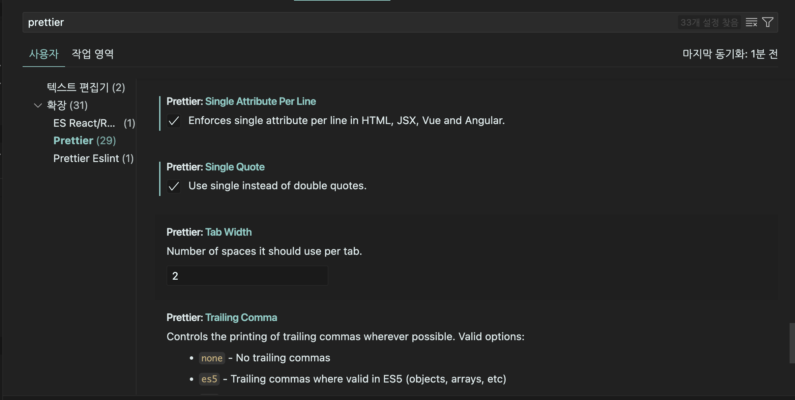
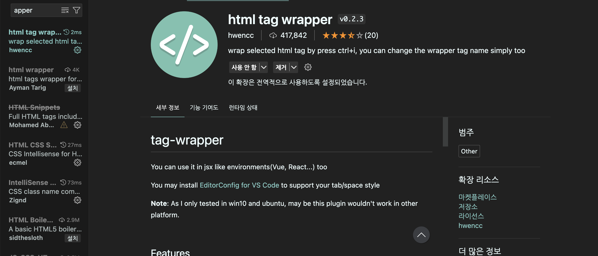
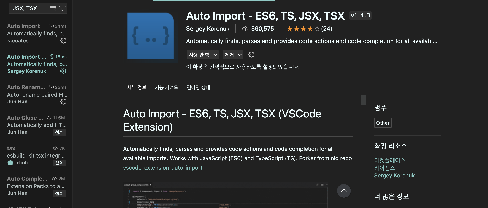
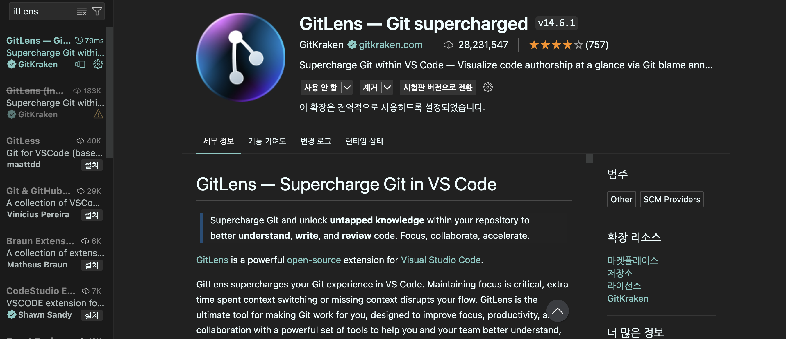
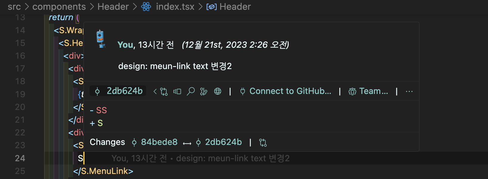

## 1. Material Theme & Material Icon Theme

|             |             |
| ----------- | ----------- |
|  |  |

두개의 익스텐션을 설치해줍니다.

**Material Theme 사용법**

|             |             |
| ----------- | ----------- |
|  |  |

원하는 색상을 골라 선택해주면 vscode 테마 색상을 바꿀 수 있습니다. (code를 오래보고 있으면 눈아프니 어두운 색상으로 해주시면 👍)

**Material Icon Theme 사용법**

|             |             |             |
| ----------- | ----------- | ----------- |
|  |  |  |

폴더 아이콘 테마도 사진과 같이 바꿀 수 있습니다.

## 2. Prettier


코드를 정해진 규칙에 맞춰 이쁘게 포맷팅 해주는 익스텐션입니다.

|             |             |
| ----------- | ----------- |
|  |  |

`command + ,` → prettier 검색 → Tab Width 2 , Single Quote 체크 → format on 검색 → format on save 체크해주시면 됩니다.


간혹 prettier가 적용이 안되거나 하는 경우에는 Default Formatter 확인해보면 null 이거나 설정이 잘못되어 있는 경우가 있기 때문에 prettier로 설정해줍니다.

## 3. ESLint


문법 에러나 버그를 찾아주는 기능을하는 익스텐션입니다.


위 사진처럼 문법 에러나 버그가 발생했을 때 알려줍니다.

## 4. indent-rainbow


들여쓰기한 부분의 서로 다른색을 넣어줘서 코드의 가독성을 올려주는 익스텐션입니다.


중첩이 많이 되는 스크립트나 html 단계를 구분할 때 아주 유용합니다.

## 5. Highlight Matching Tag

|             |             |
| ----------- | ----------- |
|  |  |

시작 태그에 포커스를 맞추면 닫는 태그에도 밑줄로 표시되어 빠르게 찾을 수 있는 익스텐션입니다.

## 6. Html Tag Wrapper



html에서 tag들을 감쌀 때 유용한 익스텐션입니다.

|             |             |
| ----------- | ----------- |
|  |  |

설정 -> 바로 가기 키 -> extension.wrapTag 단축키를 원하시는걸로 지정을 해줍니다.(전 `command + shift + W`) 감싸고 싶은 태그를 드래그 하고 단축키를 사용하면 기본 값으로는 div 태그가 감싸집니다.

만약 지우고 싶으면 지우고 싶은 태그를 드래그 한 다음 `command + shift + P` 팔레트를 열어 remove 검색하면 Emmet: Remove Tag 를 선택하면 됩니다.

## 7. Auto Rename Tag


시작 태그만 바꿔도 닫는 태그도 자동으로 바뀌는 익스텐션입니다.

## 8. Auto Import - ES6, TS, JSX, TSX



React와 같이 component 기반의 라이브러리를 사용할 때 유용한 익스텐션입니다.

가져올 파일이나 API의 경로를 일일히 적어주지 않아도 자동으로 import 해줍니다.

## 9. ES7+ React/Redux/React-Native snippets

|             |             |
| ----------- | ----------- |
|  |  |

snippet은 코드 조각을 뜻하는데 짧은 접두어를 입력하면 지정한 템플릿이 자동으로 완성해줘서 반복적으로 작성되는 코딩시간을 절약해주는 익스텐션입니다.

## 10. Multiple cursor case preserve


변수명이나 값을 변경할 때 대문자였던건 대문자로, 소문자였던건 소문자로 구분해주면서 바꿔주는 익스텐션입니다.

## 11. GitLens

|             |             |
| ----------- | ----------- |
|  |  |

보고 싶은 코드라인에 포커스를 두고 마우스를 올리면 코드 작성자와 커밋이력 메세지들이 표시되어서 버전관리에 유용한 익스텐션입니다.

**제가 유용하고 좋았던 익스텐션을 소개해보았습니다.**

```toc

```
