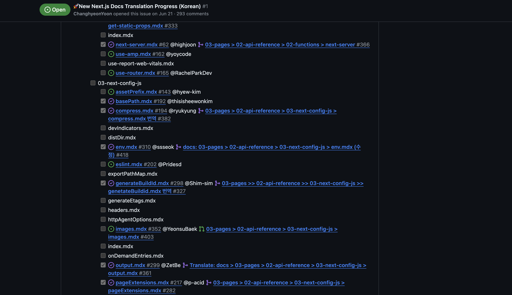
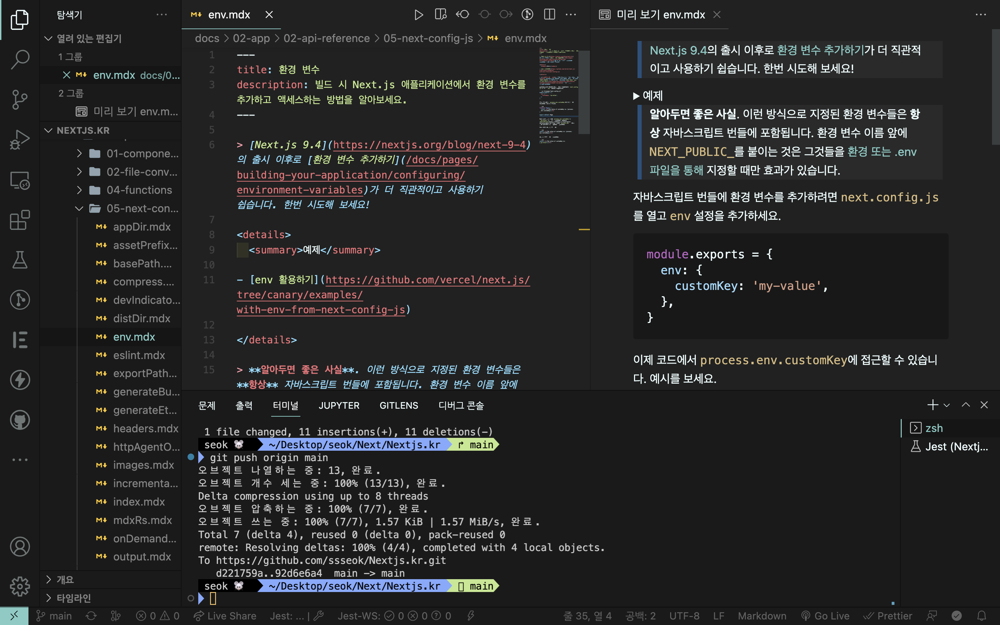
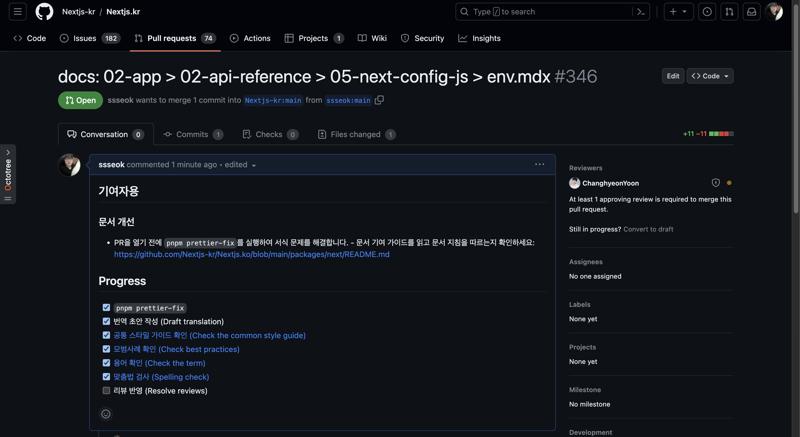
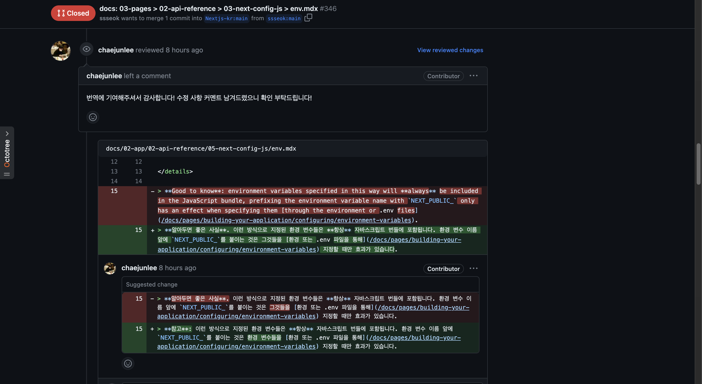
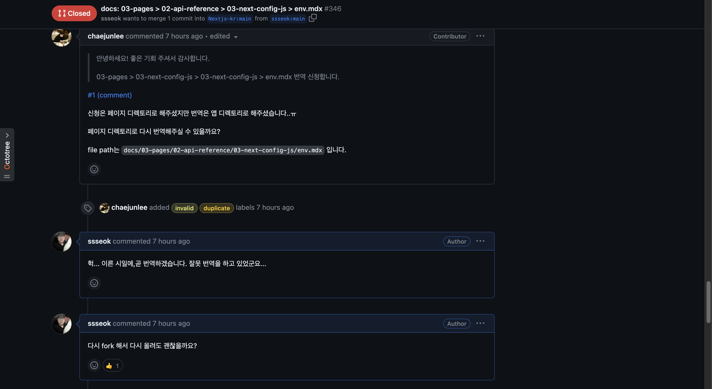
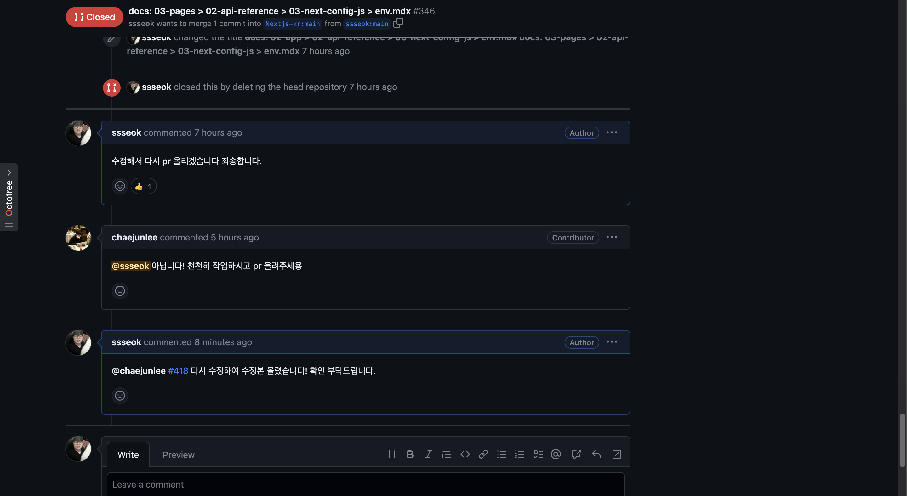

## 👋 Next.js Docs 한글화 작업 오픈 소스의 기여의 참여하게 된 점

이번 해 6월 정도였다.

내가 개발하고 있는 이상 작은 것이 됐든 아니든 오픈 소스 기여에 대한 꿈이 이었다.

개발 공부를 하면서 github을 자주 애용하고 있는 와중에 Explore repositories에 Next.js Docs 한글화 작업이 떠 있어서 들어가 보게 되었다.

마침 요새 next.js를 사용하여 개발을 진행하고 있었고, 공식 문서를 보고 공부를 한다고 하지만 언어 장벽에 좌절하고 있는 나 자신을 뒤돌아보게 되며 한글화 작업은 꼭 진행이 되어서 다른 개발자분들도 쉽게 공부할 수 있었으면 하는 바람으로 참여하게 되었다.

[Nextjs-kr](https://github.com/Nextjs-kr/Nextjs.kr)

## Next.js Docs 한글화 작업 오픈 소스 기여하는 방법

먼저 하고 싶은 한글화 작업이 있으면 답글을 달아주면 이슈로 할당을 해줍니다.

Nextjs.kr에서 정해준 규칙대로 번역한 과정입니다.([규칙](https://github.com/Nextjs-kr/Nextjs.kr/issues/1)에 For New Translators을 자세히 읽으시면 됩니다.)

그리고 PR을 제출하기 전에는 `pnpm prettier-fix`를 실행하여 Prettier를 실행해야 합니다.

먼저 `pnpm install`를 실행해 주시고 `pnpm prttier-fix`를 하면 전체 파일을 검사하기 시작합니다.

|             |             |
| ----------- | ----------- |
|  |  |

정해진 번역 파트의 번역 후 pull requests 하여 리뷰 반영 중인 모습이다.(하지만 이때까지 몰랐었다. 내가 잘못된 파트에서 번역할 줄은…)

|             |             |
| ----------- | ----------- |
|  |  |

리뷰 반영 및 피드백을 받은 모습이며 그리고 잘못된 파트를 번역한 나의 모습…

하지만 바로 피드백을 받고 회사 끝나고 집에 와서 다시 번역하고 피드백을 수용하여 다시 pr 하였다.

**정신차리자 석아**
