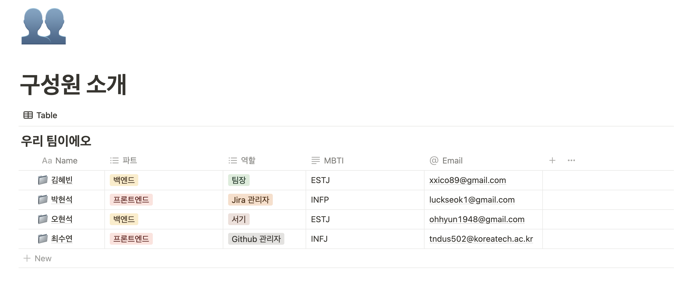
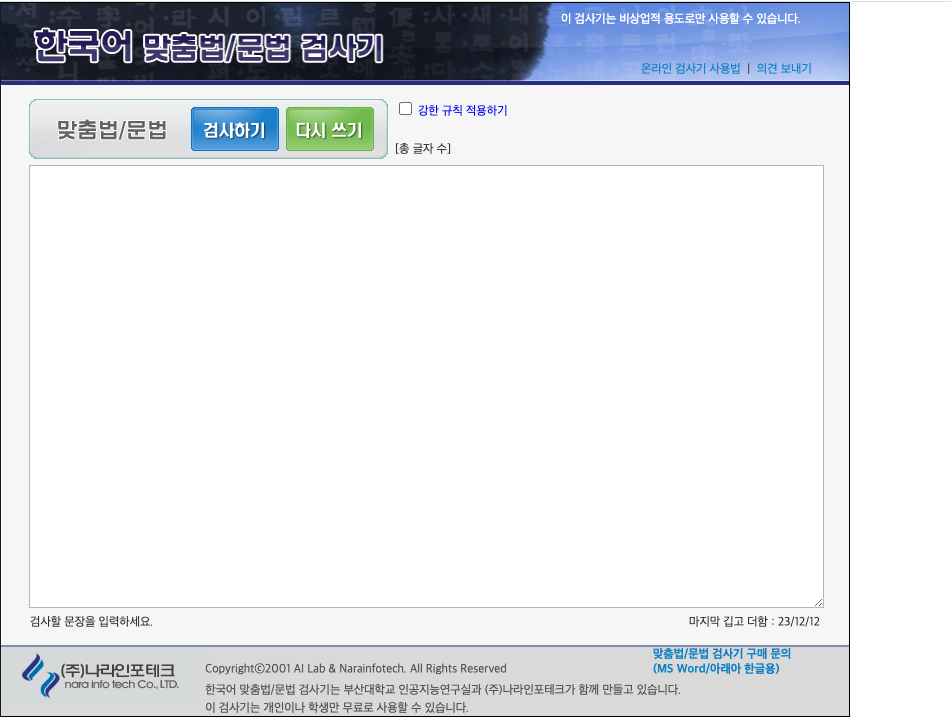
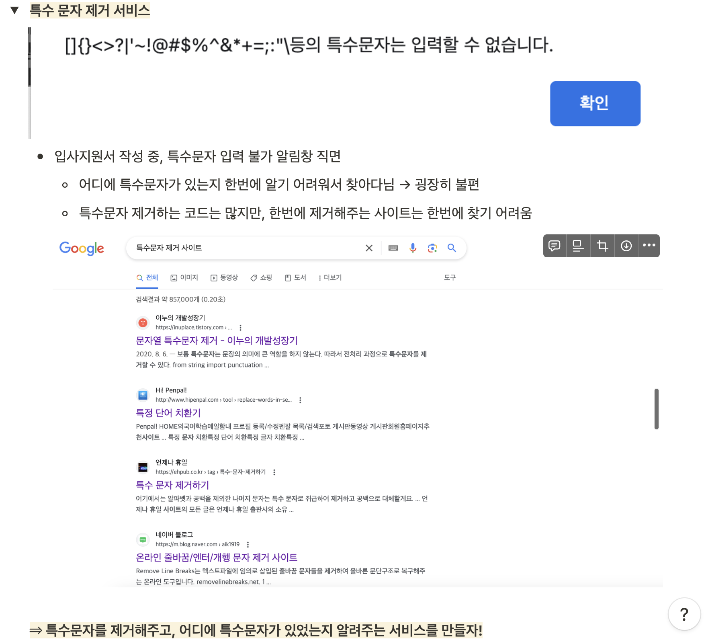
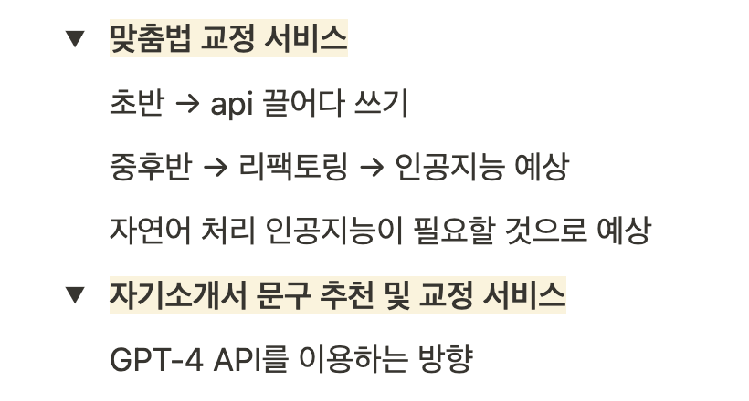
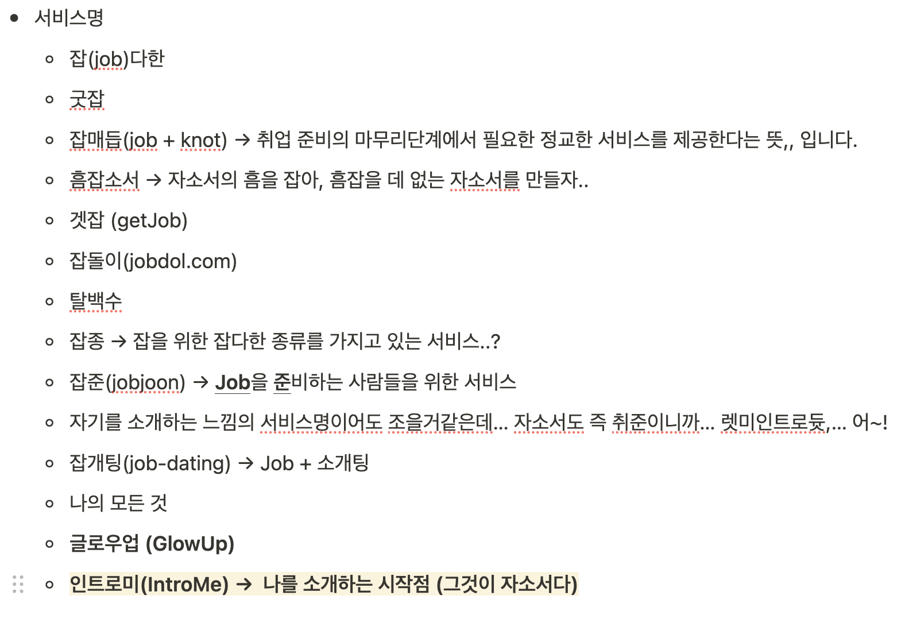

## ✨프로젝트에 참여하게 된계기✨

개발공부를 하고 있는 도중에 혼자 독학으로 공부하기에는 너무 나태해지는 나를 보고 [Hola](https://holaworld.io/)에서 프로젝트를 탐색하는 도중에 자기소개서 교정 서비스라는 프로젝트를 보고 흥미가 있어서 연락을 해봤는데 좋다고 하셔서 같이 합류하게 되었다.

### 🧑🏻‍💻구성원
백엔드 2명 프론트엔드 2명 디자이너 1명 이렇게 진행하기로 했지만, 디자이너는 구하지 못한 채 우리의 첫 프로젝트 회의는 진행되었다.

일단 자기소개를 시작했다.

역할을 나누게 되었고 MBTI를 확인해보니깐 백엔드분들은 다들 E 성향이셨다.(프론트엔드는 I..)

### 👀팀 명
그 다음으로는 팀 명을 정하기로 했는데 그냥 혜빈님과 제가 짱구 프로필 사진을 하고 있어서 그런지 심플하게 찡구네(짱구네)라고 짓게 되었다.

그리고 간단하게 서비스 기능들을 나열해보았는데 일단 크게 맞춤법, 특수문자 제거, 추후에 커뮤니티 확장을 구상했다.
대상은 대학생으로 잡았다.

### 📄기획안
혜빈님 팀장님께서 기획안을 간단하게 적힌 거를 보여주셨는데.

이것은 거의 전국민이 썼다고 해도 과언이 아닌 맞춤법 검사기인데

혜빈 : **＂자기소개서를 작성할 때 맞춤법 체크, 특수문자 제거 등 여러 가지 신경 써야 할 부분이 있기 때문에 한 번에 처리해주는 사이트를 찾은 적이 있다. 내가 원하는 서비스가 모두 합쳐진 사이트는 없었고, 무료로 맞춤법을 체크할 수 있는 사이트는 UI가 예쁘지 않아서 아쉬움이 있었다. ＂**
라고 적어놓으셨다.

따라서 한 개의 사이트 내에 맞춤법 기능, 특수문자 제거 기능 등 여러 서비스를 한 번에 제공하여
자소서 쓰는 취준생들이 쓰기 좋은 총집합 서비스를 만들자는 취재였다.

그리고 시장조사까지 하셨는데 다른 맞춤법 검사기에서는 특수문자 제거기능이 딱히 없었던 거 같았다.

나는 몰랐지만, 팀장님께서 다른 회사에 자기소개서를 넣으실 때 ,(쉼표) .(점)을 제외한 특수문자는 안된다는 곳도 있다고 하셨다.

그러면 작성해놓은 자기소개서에 ＂＂(따옴표)나 이런 게 있으면 넣을 때 일일이 지워서 제출해야 한다는 불편한 점이 있겠다는 생각을 했다.

따라서 기능은 일단 특수 문자 제거, 맞춤법 교정, 자기소개서 문구 추천 및 교정

|             |             |
| ----------- | ----------- |
|  |  |

**기대효과**

- 취업을 준비하는 사람들에게 도움이 될 수 있다.
- 자기소개서를 작성할 때마다 자주 찾게 되는 서비스가 될 수 있다. → 더 나아가 **자소서 뿐만이 아닌 취준생들이 이용하는 커뮤니티로 확장 가능!**

그리고 백엔드, 프론트엔드 나눠서 기술 스택에 대해 이야기를 나눴다.

우리 프론트엔드는 TypeScript, React, React Query, Redux, TailwindCSS로 사용하기로 했다.

### 서비스명
그리고 서비스명을 정하기로 했는데 정말 많은 의견을 내주었다.

모두의 의견으로 IntroMe의 프로젝트가 탄생하게 되었다.

첫날의 회의는 이렇게 끝이 났다.

# 다음시간에..
